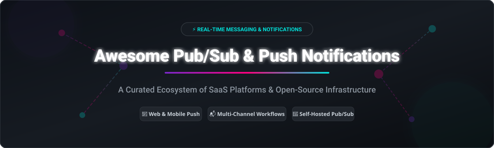

# 🚀 Awesome Publish-Subscribe (Pub/Sub) Messaging & Push Notifications Ecosystem

  

  
  
  
  
  

---

## 📌 Overview & Ecosystem Highlights

Welcome to the definitive, curated directory of **Publish/Subscribe (Pub/Sub) messaging backbones**, **multi-channel notification infrastructure**, and **self-hosted push notification engines**. 

Whether you are scaling high-throughput event-driven microservices with Kafka/NATS, integrating cross-platform web and mobile push notifications via OneSignal or Firebase Cloud Messaging (FCM), or orchestrating multi-channel email/SMS/Slack notification workflows using Novu or Courier, this guide maps out both hosted SaaS platforms and open-source tools.

---

## 📑 Table of Contents
- [📊 SaaS & Hosted Platforms](#-saas--hosted-platforms)
- [🔓 Open-Source GitHub Projects](#-open-source-github-projects)
  - [⚡ Notification Infrastructure](#-notification-infrastructure)
  - [📡 Pub/Sub Messaging Platforms](#-pubsub-messaging-platforms)
  - [📲 Push Notification Services & Libraries](#-push-notification-services--libraries)
  - [📟 Specialized Brokers & Transport Protocol Engines](#-specialized-brokers--transport-protocol-engines)
- [🛠️ How to Contribute](#️-how-to-contribute)
- [⭐ Support & Sponsorship](#-support--sponsorship)
- [⚠️ Disclaimer](#️-disclaimer)
- [📈 Star History](#-star-history)

---

## 📊 SaaS & Hosted Platforms

> 💡 **Market Size & Industry Dynamics Analysis**:  
> The global **Messaging & Push Notification Software Market** is estimated at **$18.5 Billion in 2026** (growing at a CAGR of ~19.2% toward real-time customer engagement and event-driven architecture).  
> The sector exhibits **moderate fragmentation**: While mobile push delivery relies on OS-level gateways (Apple APNs & Google FCM), the enterprise communication API and notification routing layer is led by major CPaaS leaders (*Twilio*, *Sinch*, *AWS SNS*) alongside fast-growing developer-first notification workflow platforms (*Novu*, *Knock*, *Courier*).

| Platform | Description | Starting Paid Price | Free Tier Limit | Company Size (Valuation / Revenue) |
| :--- | :--- | :--- | :--- | :--- |
| **[Amazon SNS](https://aws.amazon.com/sns/)** | AWS's pub/sub messaging service for mobile push, SQS, Lambda, email, SMS. | $0.50 per 1M Standard topic requests | 1M API requests & 1M push notifications per month | ~$2.0 Trillion (AWS ~$105B ARR parent) |
| **[Firebase Cloud Messaging](https://firebase.google.com/products/cloud-messaging)** | Google's cross-platform push notification service for mobile and web. | 100% Free (Blaze plan pay-as-you-go for linked services) | Unlimited free messages & push notifications | ~$2.1 Trillion (Google/Alphabet parent) |
| **[Twilio](https://www.twilio.com/)** | Omnichannel communication APIs for SMS, voice, email, and push. | $0.0083/SMS, $1.15/mo per phone number | Free trial with ~$15 test credit | ~$44 Billion Market Cap ($5.07B ARR) |
| **[Sinch](https://www.sinch.com/)** | Cloud communications platform for SMS, voice, video, and push notifications. | $0.0078/SMS or custom payload plans | 14-day free trial with test credits | ~$3.2 Billion Market Cap ($2.5B ARR) |
| **[Bird (MessageBird)](https://bird.com/)** | Omnichannel communication platform for SMS, email, WhatsApp, and push. | $45/month starting tier | 1,000 emails/month or 5 SMS/day free | ~$900 Million ARR (~$3.8B Peak Valuation) |
| **[OneSignal](https://onesignal.com/)** | Leading push notification & customer engagement platform for mobile & web. | $19/month (Growth plan) | 1,000 Monthly Active Users (MAU) for mobile push | ~$50 Million total funding ($21.6M ARR) |
| **[Pusher Channels](https://pusher.com/channels)** | Real-time WebSocket pub/sub channels for application features. | $49/month (Startup plan, 1M msgs/day) | 200,000 messages/day & 100 concurrent connections | ~$9.2 Million total funding (~$15M ARR) |
| **[Knock](https://knock.app/)** | Developer-first notification infrastructure & workflow engine. | $250/month (Starter plan) | 10,000 notifications/month | ~$46 Million total funding (~$9.1M ARR) |
| **[Courier](https://www.courier.com/)** | Notification infrastructure API to route across email, SMS, push, & chat. | $0.005 per send (Business plan) | 10,000 free sends/month | ~$42 Million total funding (~$8M ARR) |
| **[Novu](https://novu.co/)** | Cloud-managed open-source notification infrastructure platform. | $30/month (Pro plan) | 10,000 workflow runs/month | ~$6.7 Million total funding |

---

## 🔓 Open-Source GitHub Projects

The open-source ecosystem provides robust, self-hosted building blocks for pub/sub event streaming and notification delivery. Below projects are categorized and sorted by **GitHub_Stars (descending)**.

### ⚡ Notification Infrastructure

- **[Novu](https://github.com/novuhq/novu)**   
  **The leading open-source notification infrastructure platform** (MIT License). Unified API for email, SMS, push, in-app inbox, Slack, Teams, Discord, and WhatsApp. Features a visual drag-and-drop workflow editor, conditions, delays, digest engine, embeddable notification center, and subscriber preference management.

- **[ntfy](https://github.com/binwiederhier/ntfy)**   
  **Simple HTTP-based pub/sub notification service** (Apache-2.0 / GPL-2.0). Send desktop and mobile push notifications via simple `PUT`/`POST` requests with Android/iOS apps and Web UI support.

- **[Apprise](https://github.com/caronc/apprise)**   
  **Push notification wrapper library for 100+ services** (MIT License). Provides a unified Python API and CLI to trigger notifications across Telegram, Discord, Slack, SMS, Email, and custom webhooks.

- **[Gotify](https://github.com/gotify/server)**   
  **Self-hosted push notification server** (MIT License). Real-time message push server with REST Web APIs, web interface, and native Android application client.

- **[Notifire](https://github.com/notifirehq/notifire)**   
  Predecessor open-source notification project, now merged into Novu core.

- **[Notifuse](https://github.com/Notifuse/notifuse)**   
  Open-source multi-channel notification engine for modern app development.

---

### 📡 Pub/Sub Messaging Platforms

- **[Redis](https://github.com/redis/redis)**   
  **In-memory data structure store with native Pub/Sub** (BSD-3-Clause / Dual). Ultra-fast lightweight channels for real-time pub/sub messaging and memory caching.

- **[Apache Kafka](https://github.com/apache/kafka)**   
  **Distributed event streaming platform** (Apache-2.0 License). Industry standard for high-throughput, fault-tolerant pub/sub message logging and persistent stream processing.

- **[EMQX](https://github.com/emqx/emqx)**   
  **Scalable open-source MQTT broker** (Apache-2.0 License). High-performance pub/sub messaging server for IoT, IIoT, and connected vehicles.

- **[NATS Server](https://github.com/nats-io/nats-server)**   
  **Cloud-native messaging system** (Apache-2.0 License). Ultra-lightweight, extremely fast pub/sub core with JetStream engine for persistent stream storage.

- **[Apache Pulsar](https://github.com/apache/pulsar)**   
  **Distributed pub/sub messaging and streaming platform** (Apache-2.0 License). Designed for multi-tenancy, native geo-replication, and tiered storage backends.

- **[RabbitMQ](https://github.com/rabbitmq/rabbitmq-server)**   
  **Multi-protocol message broker** (MPL-2.0 License). Robust messaging support for AMQP, MQTT, STOMP, and flexible exchange pub/sub patterns.

- **[Centrifugo](https://github.com/centrifugal/centrifugo)**   
  **Scalable real-time messaging server** (Apache-2.0 License). Language-agnostic WebSocket, HTTP-streaming, SSE, and gRPC pub/sub server with channel presence & history.

- **[Eclipse Mosquitto](https://github.com/eclipse/mosquitto)**   
  **Lightweight MQTT message broker** (EPL-2.0 / EDL-1.0). Ideal for low-power IoT messaging and edge pub/sub architectures.

- **[Mercure](https://github.com/dunglas/mercure)**   
  **Server-Sent Events (SSE) real-time pub/sub hub** (AGPL-3.0 License). Built-in authorization, HTTP/2 & HTTP/3 native push protocol for web apps.

---

### 📲 Push Notification Services & Libraries

- **[web-push](https://github.com/web-push-libs/web-push)**   
  **Web Push library for Node.js** (MIT License). Enables sending VAPID-encrypted push notifications directly to browser push services (W3C Web Push standard).

- **[Pushgateway](https://github.com/prometheus/pushgateway)**   
  **Prometheus metrics push acceptor** (Apache-2.0 License). Allows ephemeral and batch jobs to push metrics to Prometheus monitoring stacks.

- **[pywebpush](https://github.com/web-push-libs/pywebpush)**   
  **Web Push library for Python** (MPL-2.0 License). Python implementation of Web Push protocol with VAPID authentication support.

- **[PushSharp](https://github.com/Redth/PushSharp)**   
  Legacy .NET client library for APNs, FCM, and GCM push notifications (Archived).

---

### 📟 Specialized Brokers & Transport Protocol Engines

- **[NATS.io Go Client](https://github.com/nats-io/nats.go)**  — High-performance Go client for NATS pub/sub.
- **[Gorush](https://github.com/appleboy/gorush)**  — Go-based push notification server using APNs2 and FCM.
- **[UnifiedPush](https://github.com/UnifiedPush/common-proxies)**  — De-googled, decentralized push notification standard for Android & Linux.

---

## 🛠️ How to Contribute

Contributions are highly welcomed to keep this repository accurate, up-to-date, and comprehensive!

1. **Fork** the repository on GitHub.
2. **Add or Edit** entries in `README.md` maintaining the existing tabular/list conventions.
3. **Verify Info**: Include project name, direct link, licensing, clear 1–2 sentence description, and accurate metrics.
4. **Submit a Pull Request** with a descriptive title (e.g., `Add Project X to Open-Source Pub/Sub`).

Check out our curated list directory: [Awesome-Awesome-Awesome](https://github.com/ishandutta2007/Awesome-Awesome-Awesome)!

---

## ⭐ Support & Sponsorship

If you find this curated directory helpful for your architecture research or production setup, please consider supporting the project:

- 🌟 **Star this repository** to help others discover it on GitHub.
- 🔀 **Fork & Share** with fellow software engineers, DevOps teams, and tech communities.
- 💖 **Sponsor the Maintainer**: Support ongoing open-source curation and developer tooling via [GitHub Sponsors](https://github.com/sponsors/ishandutta2007).

---

## ⚠️ Disclaimer

- This list is **community-curated** for educational and architectural decision-making purposes.
- **Security & Privacy**: Self-hosted pub/sub platforms and notification servers handle user data and communication preferences. Hardening access controls, TLS encryption, and compliance with data protection laws (GDPR, CCPA, CAN-SPAM) are the responsibility of the operator.
- **Mobile Platform Dependencies**: Apple APNs and Google FCM mediate all native mobile push deliveries; self-hosted notification servers wrap around these upstream services.
- **Licenses**: Always review individual project licenses (MIT, Apache-2.0, AGPL-3.0, MPL-2.0) before embedding in proprietary software.

---

## 📈 Star History

---

  <b>Built with ❤️ for developers, platform engineers, and open-source enthusiasts.</b>

